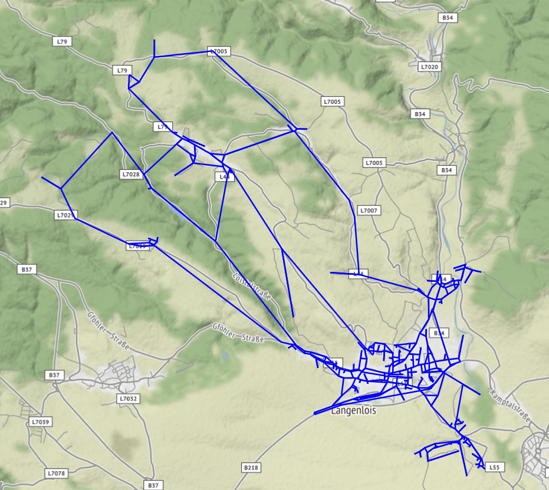

# Cycling postman problem

This project deals with the challenge to find the shortest route while using every road of a place at least once.

I started this while being affected with COVID-19 and isolated from my family. I searched for a challenge to tackle with my bike.

The idea is to use every road of a place or city in one ride. I started to plan this ride by hand, which turned out to be quite boring. Additionally I doubted that i would find the shortest route manually. So i researched, if this can be done with an application.

It turned out that this problem is known as the [Chinese postman problem](https://en.wikipedia.org/wiki/Chinese_postman_problem). Fortunately there are already libraries you can make use of.

## Output

- map with all the used edges
- gpx file (in output folder)

## Details
- maps are downloaded with osmnx (a great library)
- the actual algorithm is done by the postman_problems library
- for huge cities the processing takes really long - as the algorithm is single threaded!

## Elevation
Normally the weight of a road (edge) is measured by distance. As you know there is quite difference if you are going flat or uphill. Therefore I added the elevation to the weight all edges and therefore to the calculation. This variant is also called 'windy postman problem'.

## Requirements

- Python 3.8

This runs on python 3.8 because postman_problems is limited to this version. Fortunately osmnx is still compatible with this 3.8.

## License
[MIT](https://choosealicense.com/licenses/mit/)

